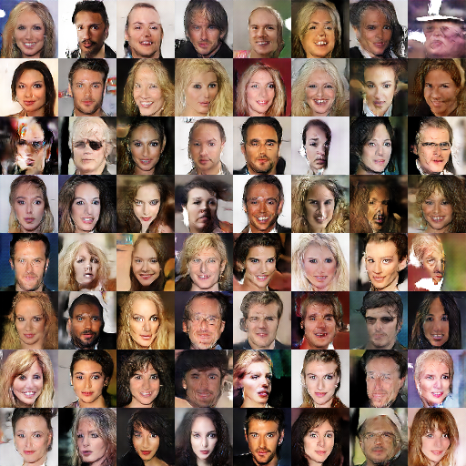
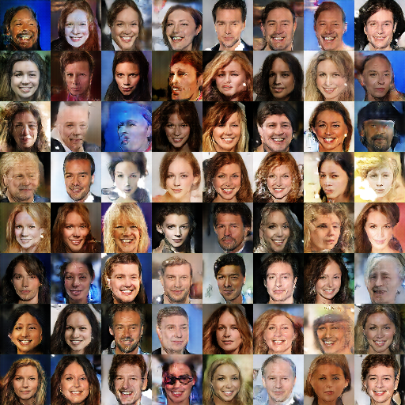
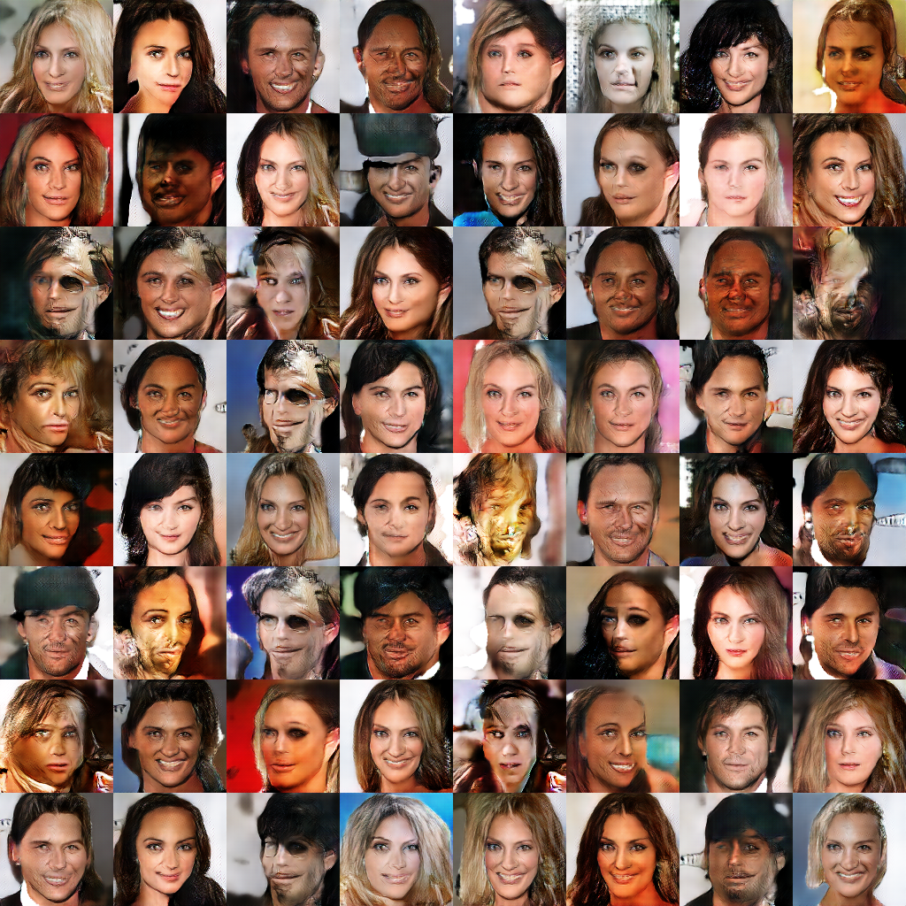
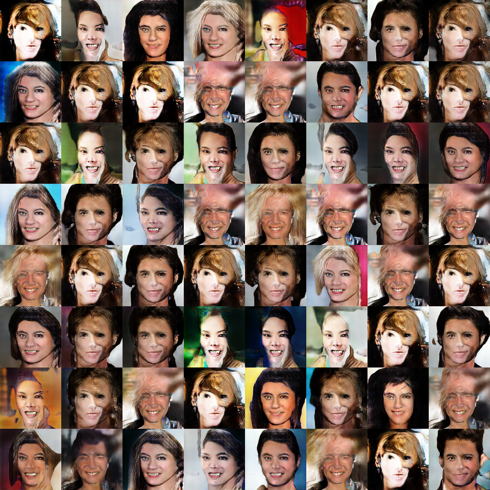

tensorflow T-GAN
======================================================

The code is tested on Linux operating system with Python 2.7 or 3.x, TensorFlow 1.4.0+

[Keras Address](https://github.com/bojone/T-GANs)

Paper Address:[Training Generative Adversarial Networks Via Turing Test](https://arxiv.org/abs/1810.10948)

Run the model using this command:
-------------------------------------
if you want to run t-sgan_64:

	python main.py --gan_type TGAN_64 --loss_type sgan --dataset celebA
	
t-wgan_64:

    python main.py --gan_type TGAN_64 --loss_type wgan --dataset celebA

t-sgan_128:

    python main.py --gan_type TGAN_128 --loss_type sgan --dataset celebA
    
t-wgan_128:
    
    python main.py --gan_type TGAN_128 --loss_type wgan --dataset celebA

you also can try lsgan loss.

Please kindly look at the file `main.py` for hyperparameter arguments.

## Tensorflow Version

if your tensorflow version >= 1.8, you can set self.custom_dataset = True else self.custom_dataset = False

## Results

### Random generation for 64x64 images

All results are randomly sampled.

*Name* | *Result-64x64* 
:---: | :---: 
T-SGAN |   
T-WGAN | 

### Random generation for 128x128 images

All results are randomly sampled.

*Name* | *Result-128x128* 
:---: | :---: 
T-SGAN |   
T-WGAN | 